#EYEBOMBING - SUMMATIVE PRESENTATION 

To start this document, I'd like first to call out what Eyebombing is. Here we've got the definition of Eyebombing by their official website www.eyebombing.com.

> "**Eyebombing** is the art of sticking “googly eyes” onto an inanimate object in the public sphere, in a way that cleverly lends the object the appearance of a living creature. Ultimately the goal is to humanize the streets, and bring sunshine to people passing by."  

My personal definition would be that Eyebombing is the art of being able to visualise a face or facial features in an animated object.  

With that being said, I'm going to include in this document two visual perception principles that I had to do research on with two classmates. I want to talk about this because I find it quite interesting and it helped me a lot when I was working on taking pictures for the Eyeboming project.  

**Two visual perception principles:** 
* **Similarity**: It is the state or fact of being similiar. To see something that has a similar feature or aspect than another object. 

Here we've got an example: 

 

For example all of these fruits are apples which there is similarity between them but they are all different at the same time.

We tend to group things together based on similar aspects ( look, sound, texture, taste, etc.) Grouping fruits by what type of fruit they are, their size, their shape and their colour.

Here we've got another example:   

 

Everything in life is ultimately similar but not really the same. If we look at the piture above, the second line will never look exactly the same as the first line, but for our eyes they are quite similar. 

* **Past experiences**: The way a person sees something could change depending of their past experiences.    

A past experience could influence how we perceive what we see. For example, an art student would have different thoughts than a business student.  

The art student might look at the colour and the shapes, while the business student might look at how that apple tree could potentially become a commission.  

Here we've got an example: 

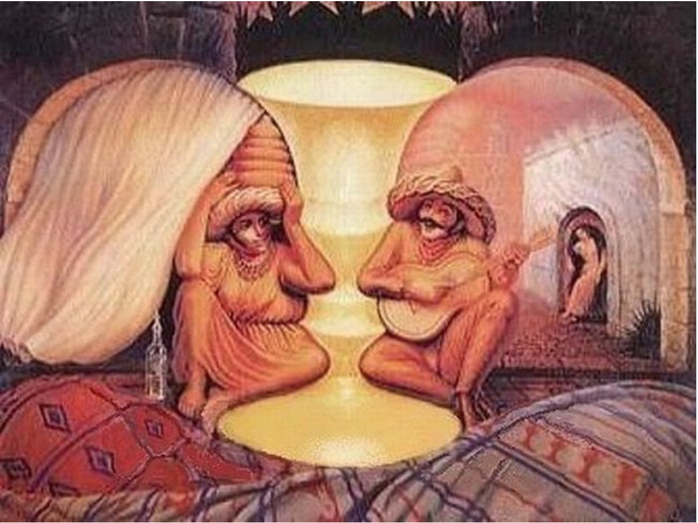

Some people can see things that other people can't see in this picture and viceversa. This is what I mean: 

Some people might see first a curtain, other people might see first a man playing the guitar, etc. Here's another example of what people could also see in this image: 

  
  

##Eyebombing pictures

Now it's time to show the Eyebombing pictures that I've taken for this project: 

* The first image is meant to be a face. The eyes are the holes of the table that we use in class to put our cables through them so we can reach the plug in the floor and charge our laptops. The nose is a black plug that is facing  up so it gives the sense of being a nose. The mouth is a simple piece of paper, it gives the sense of being an open mouth or a big mouth.   

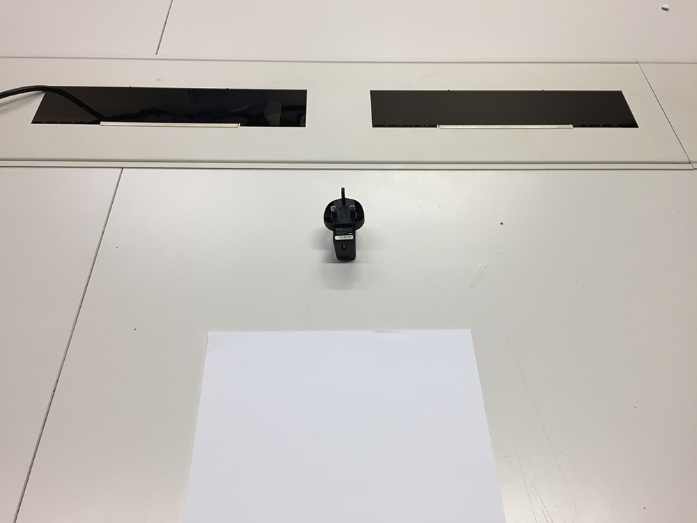

* The second image gives an aspect of a old man (well, that's what I think). Being the eyes the two locks and the mouth is supposed to be very small or hidden by the _moustache_ , which is interpretated by the plastic. 

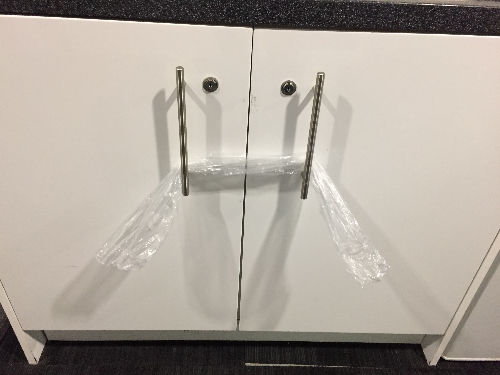 

* Here we've got a case where is probably harder to identify the elements of a face than the other two pictures above. We can clearly see the eyes that are represented by the two blue stickers that have got the message "Fire Door Keep Locked" in them. Now, is the lock below the mouth or the nose? I actually don't know, I guess you can interpret it as you wish. In my case I would say it's a really small mouth which will make this face with no nose. Such a shame. 

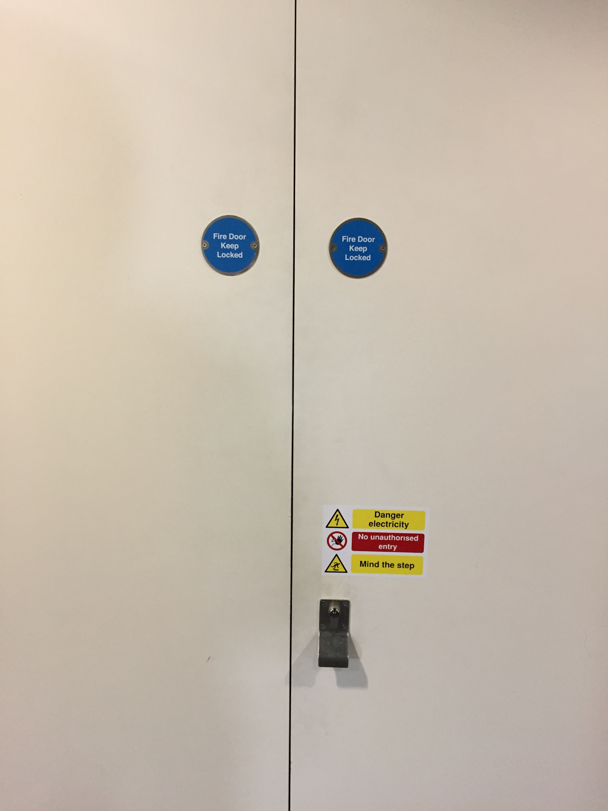

* Now we've got an image that is made by three windows from the entrance wall of Ravensbourne. I think it's quite easy to see a face here, two big eyes with an open mouth and again with no nose. 

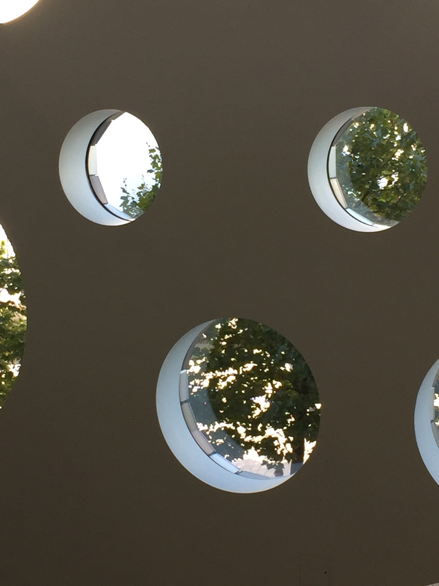

* Again, using the windows from Ravensbourne's building, we can see a face here. In this case with a much bigger mouth than the one above but they share the same problem. They don't have a nose =( .

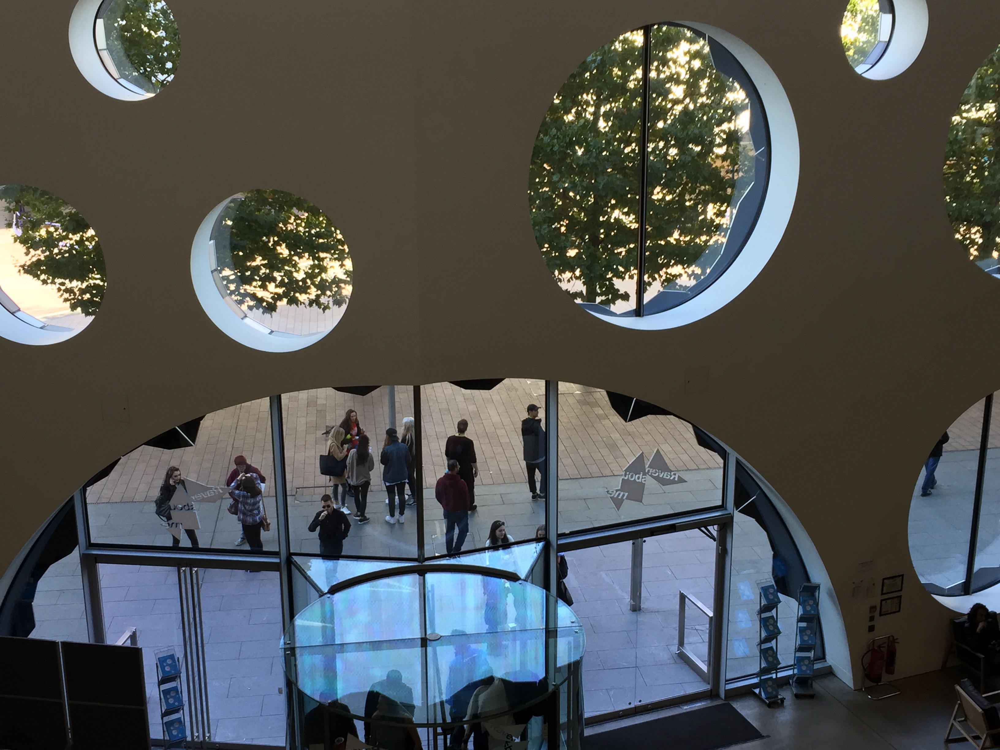 

* In this image might be a bit hard to see the face because of the colours. The eyes would be the two stains on the middle top and the mouth would be the stain that is being crossed by a line. 

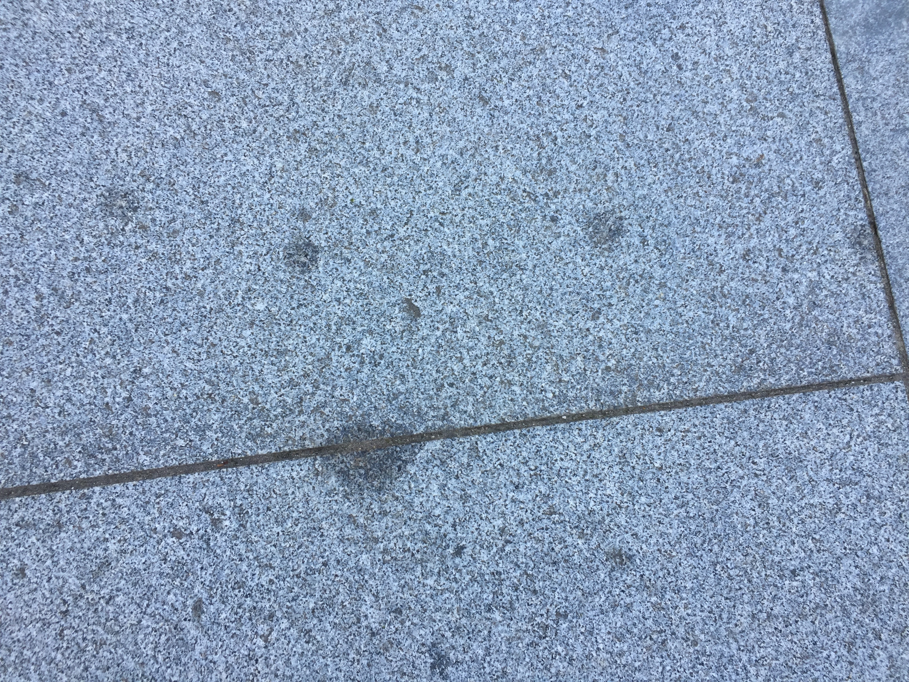

* Because it's not really easy to see what I mean, I edited this picture in photoshop and I played with the contrast and brightness.  This is the result and I think it's a little bit easier to see the face now. 

 

* Here we've got a sort of a robot face. A simple rectangle with two holes that we can interpret them as the eyes. 

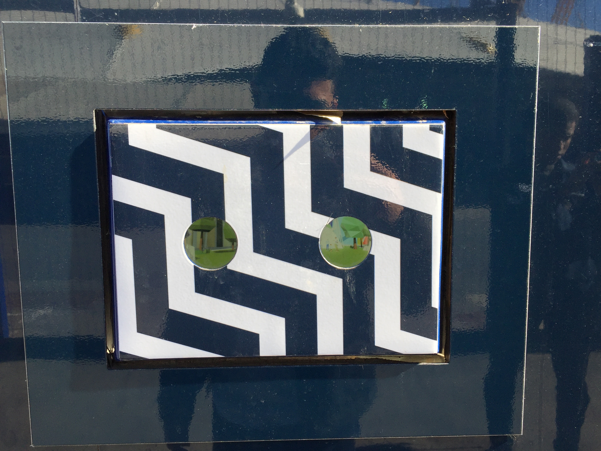

* This image is not really a human face as you can tell. Some people might see an elephant some people might see a simple ''T". But what this reminds me of is to [this picture.](https://elaineqle.files.wordpress.com/2015/02/moai_statues.jpg) There are statues from a place called Machu Picchu located in Peru, a country from south america. I guess the thoughts of this image could change depending of the past experiences of each person. I guess that the first think that comes to my mind when I see this picture below is what I just mentioned because somewho I relate the form of a "T" to a statue face and the material of the floor helps me to relate that more because it's made by rock. 

* This is a quite similar image to one that we'll be seeing in a moment. I guess we can clearly see the two eyes here being represented by the two cable cars. The mouth and the nose are not really accurate but we could interpret the big amount of metal bar sticks as a huge nose and the floor of the platform that is holding this monument up as the mouth. 

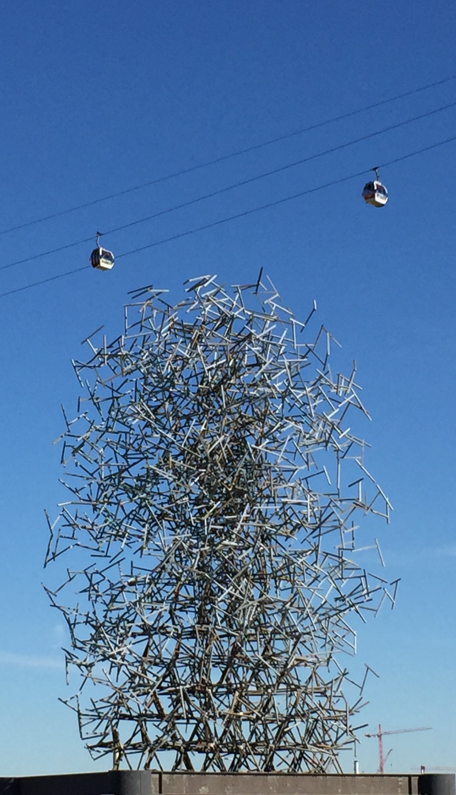

* We have arrived to my second favourite picture. You can see a face here but depending on your thoughts you will give to this face a nose or a mouth. In my case I will give it a little mouth, the nose can be interpreted by the thick line. The eyes are the two stickers that represent the "Warning" or "Danger". The reason this is my second favourite picture is because we can see a face there because of the angle of the shot. If I would've taken the picture looking at the small door from the front, we wouldn't be able to see the same face. It would be a different thing and it won't probably look as a face. 

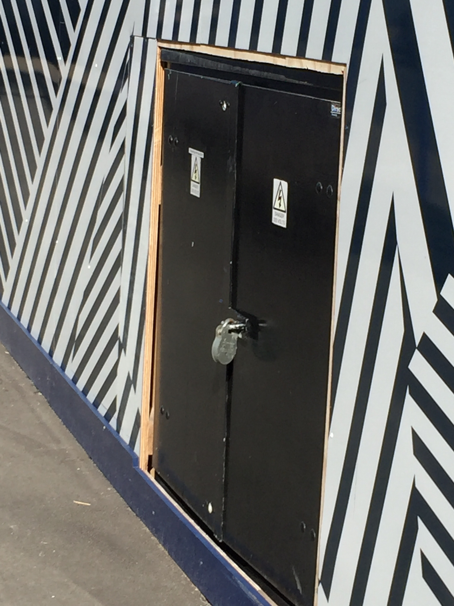

* Last but not least, my favourite picture. We can see a face here with all the elements; eyes, nose and mouth. The eyes being the two cable cars, the nose being the huge post and the mouth being the long and thick cable. Why do I love this picture? Simply because this isn't a static image. As you can guess, the cable cars are always moving, so to get the right shot and get an image like this one you have to wait for the right moment and that's what I did. 

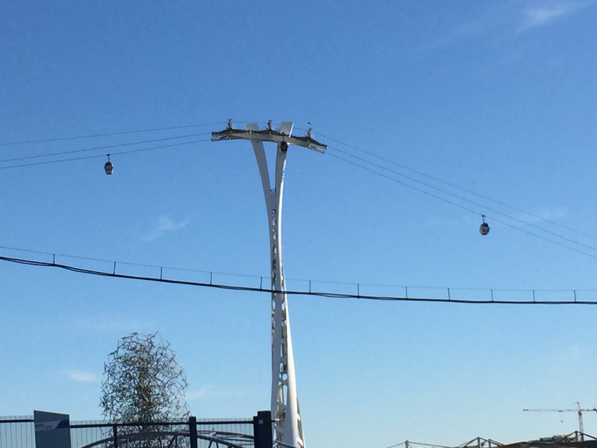

##That's it! 

Those are my favourite pictures of this project called "Eyebombing". This project helped me to be more aware of the objects that we see in our day to day routine. It's a good way to see the life, seeing a face in an animated object might give you a smile in a day that you probably need it. It also helps me to open my mind more and be more creative. This was definitely a good project, it was something different to what I'm used to do and I like that because getting out of your comfort zone always gives you new skills. 

