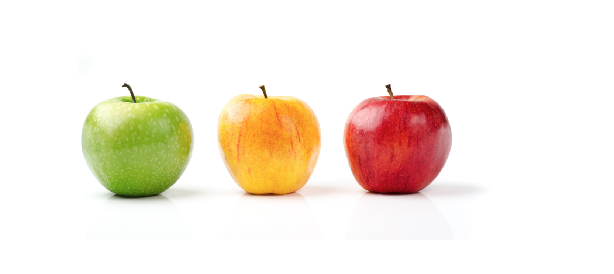
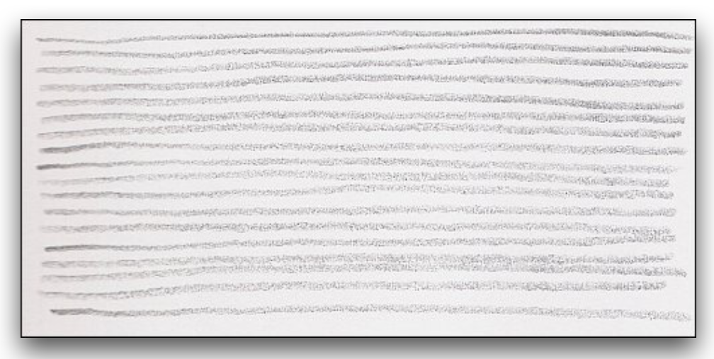

#EYEBOMBING - SUMMATIVE PRESENTATION 

To start this document, I'd like first to call out what Eyebombing is. Here we've got the definition of Eyebombing by their official website www.eyebombing.com.

> "**Eyebombing** is the art of sticking “googly eyes” onto an inanimate object in the public sphere, in a way that cleverly lends the object the appearance of a living creature. Ultimately the goal is to humanize the streets, and bring sunshine to people passing by."  

My personal definition would be that Eyebombing is the art of being able to visualise a face or facial features in an animated object.  

With that being said, I'm going to include in this document two visual perception principles that I had to do research on with two classmates. I want to talk about this because I find it quite interesting and it helped me a lot when I was working on taking pictures for the Eyeboming project.  

**Two visual perception principles:** 
* Similarity.  
Smilarity is the state or fact of being similiar, a similar feature or aspect. 

Here we've got an example: 

 

For example all of these fruits are apples which is there similarity but they are all different at the same time.

We tend to group things together based on similar aspects ( look, sound, texture, taste, etc.) Grouping fruits by what type of fruit they are, their size, their shape and their colour.

Here we've got another example:   

 

Everything in life is ultimately similar but not really the same. If we look at the piture above, the second line will never look exactly the same as the first line, but for our eyes they are quite similar. 